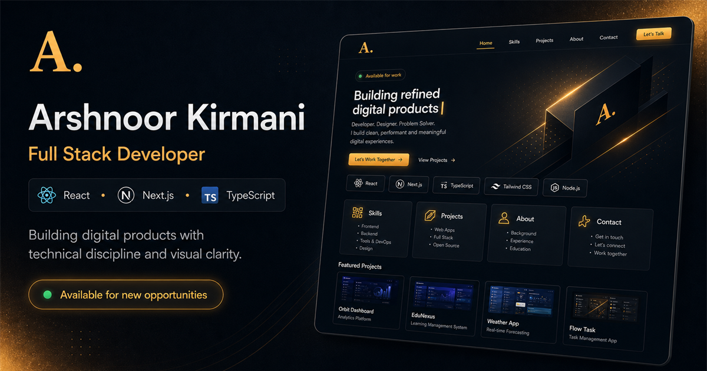

# Arshnoor Kirmani - Portfolio



> **Front-End Developer and Junior Software Engineer focused on modern web applications.**

[](https://arshnoorkirmani.vercel.app/)
[](https://nextjs.org/)
[](https://react.dev/)
[](https://tailwindcss.com/)

A personal portfolio built with Next.js App Router, React 19, and Tailwind CSS. It uses MDX for content, Shadcn UI for reusable components, and is tuned for a **97+ Lighthouse Performance Score**.

## Features

- **Fast by default**: Next.js App Router with ISR (Incremental Static Regeneration) for quick page loads.
- **MDX content**: Experience, Projects, and Education sections are generated from `.mdx` and `.json` files.
- **Modern styling**: Tailwind CSS with `oklch` colors, custom typography, and smooth motion.
- **Reusable UI**: Shadcn UI components built on accessible Radix UI primitives.
- **Responsive layout**: Mobile-friendly sections, cards, and hero animations.
- **SEO setup**: Dynamic metadata, Open Graph images, sitemap, and optimized Next/Image assets.

## Tech Stack

- **Framework**: [Next.js (App Router)](https://nextjs.org/)
- **Library**: [React](https://react.dev/)
- **Language**: [TypeScript](https://www.typescriptlang.org/)
- **Styling**: [Tailwind CSS](https://tailwindcss.com/)
- **Components**: [Shadcn UI](https://ui.shadcn.com/)
- **Animations**: [Framer Motion](https://www.framer.com/motion/)
- **Icons**: [Lucide React](https://lucide.dev/)
- **Content**: MDX, `gray-matter`
- **Deployment**: [Vercel](https://vercel.com/)

## Getting Started

### Prerequisites

Make sure Node.js 18+ is installed on your machine.

### Installation

1. Clone the repository

   ```bash
   git clone https://github.com/arshnoorkirmani/arshnoor-portfolio.git
   cd arshnoor-portfolio
   ```

2. Install dependencies

   ```bash
   npm install
   # or
   yarn install
   # or
   pnpm install
   ```

3. Start the development server

   ```bash
   npm run dev
   ```

4. Open [http://localhost:3000](http://localhost:3000) in your browser.

## Project Structure

- `app/`: Next.js App Router pages and global layouts.
- `components/`: Reusable React components.
  - `sections/`: Major page sections (Hero, About, Experience, etc.).
  - `ui/`: Core Shadcn UI building blocks.
- `content/`: `.mdx` files and JSON data for portfolio content.
- `config/`: Global site configuration (`site.ts`).
- `lib/`: Utility functions, including MDX parsing logic.

## Content Management (MDX)

To update the portfolio content without touching React code, edit the files in the `content/` directory.

### Adding a new Project

Create a new `.mdx` file in `content/projects/`:

```mdx
---
title: "Project Name"
role: "Full Stack Developer"
date: "Jan 2026 - Present"
techStack: ["Next.js", "TypeScript", "Tailwind CSS"]
image: "https://your-image-url.com"
order: 1
---

- Built core features...
- Improved performance by X%...
```

## License

This project is licensed under the MIT License. See the [LICENSE](LICENSE) file for details.

---

<p align="center">
  Built with React and Tailwind by <b>Arshnoor Kirmani</b>
</p>
